# 🧬 Splice Junction Classification

<p align="center">
  <strong>Machine Learning Classification of DNA Splice-Junction Sequences</strong><br>
  <em>From biological sequence understanding to k-mer feature engineering and classical machine learning</em>
</p>

<p align="center">


</p>

---

## 🌱 About This Project

I built this project to understand how classical machine learning can be used to work with biological sequence data.

The problem is based on identifying whether a DNA sequence represents a:

- 🟣 **EI** ,  exon → intron splice junction
- 🔵 **IE** ,  intron → exon splice junction
- 🟢 **N** ,  neither

Instead of feeding raw DNA strings directly into a machine learning model, I converted each sequence into numerical **3-mer frequency features** and used those features to train two classical classifiers:

**Support Vector Machine (SVM)** and **Random Forest**.

My goal was not just to train a classifier. I wanted to understand the full process:

> **Biological problem → Data understanding → Cleaning → DNA-specific EDA → Feature engineering → Model building → Evaluation → Interpretation**

---

## 🎯 Project Objective

The main objective of this project is to classify **60-nucleotide DNA sequences** into the three splice-junction classes using machine learning.

The project focuses on two questions:

1. Can short DNA sequence patterns provide enough information to classify splice-junction sequences?
2. How do **SVM** and **Random Forest** compare when trained on the same k-mer representation?

---

## 🧬 Biological Background

A gene contains regions known as **exons** and **introns**.

- **Exons** are regions that remain in mature RNA.
- **Introns** are removed during RNA splicing.
- A **splice junction** is the boundary between an exon and an intron.

The dataset contains sequences surrounding splice-junction boundaries. The classification task is therefore not simply "DNA classification"; it is a biological sequence-pattern recognition problem.

Understanding the biology was important to me because the model results make more sense when they are connected to the actual splice-junction problem.

---

## 📊 Dataset

I used the **UCI Molecular Biology (Splice-junction Gene Sequences)** dataset.

### Dataset characteristics

| Property | Value |
|---|---:|
| Original sequences | **3,190** |
| Sequence length | **60 nucleotides** |
| Classes | **3** |
| Final sequences after exact duplicate removal | **3,178** |
| Final k-mer features | **97** |

### Class distribution

| Class | Meaning | Approx. share |
|---|---|---:|
| EI | Exon → Intron | 24.04% |
| IE | Intron → Exon | 24.08% |
| N | Neither | 51.88% |

The **N class is the largest class**, so I considered class-wise precision, recall, F1-score, and macro F1 rather than relying only on accuracy.

---

## 🧹 Data Cleaning

During data understanding and cleaning, I checked:

- Missing values
- Sequence length
- DNA characters
- Class labels
- Whitespace/lowercase issues
- Exact duplicate rows
- Repeated DNA sequences
- Duplicate instance names
- Sequences appearing with different labels

### Important cleaning decisions

I found **12 exact duplicate rows**, which I removed.

I did **not** automatically remove all repeated sequences. Repeated biological observations can still be meaningful.

I also found one sequence appearing with two different class labels. I retained and documented this case rather than changing the labels without biological evidence.

These decisions were kept explicit because cleaning biological data should not introduce assumptions that are not supported by the dataset.

---

## 🔬 DNA-Specific EDA

Before modelling, I explored the DNA sequences using biological sequence-specific analysis.

The EDA focused on:

- Nucleotide composition by class
- Position-wise nucleotide frequencies
- Class-wise positional patterns
- Ambiguity symbols

The analysis showed differences in nucleotide composition and positional patterns across the classes, suggesting that sequence-level information can help distinguish splice-junction categories.

### Nucleotide Composition by Class

This plot gives a compact view of how the nucleotide composition differs across the three classes.

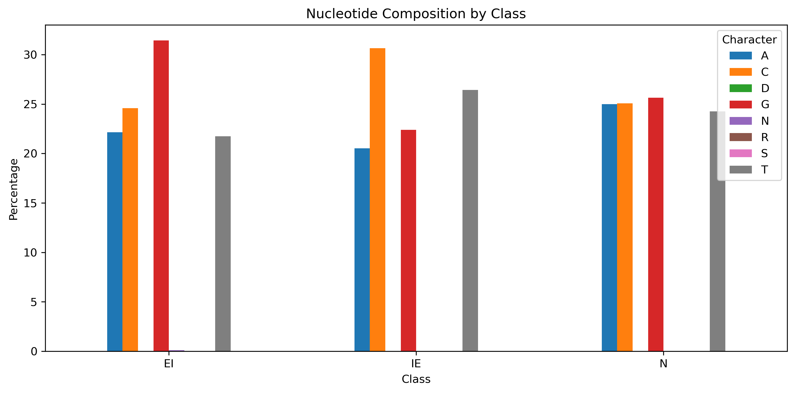

### Position-wise Nucleotide Frequencies

I also examined how nucleotide frequencies change across the 60 sequence positions.

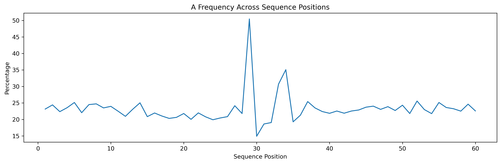

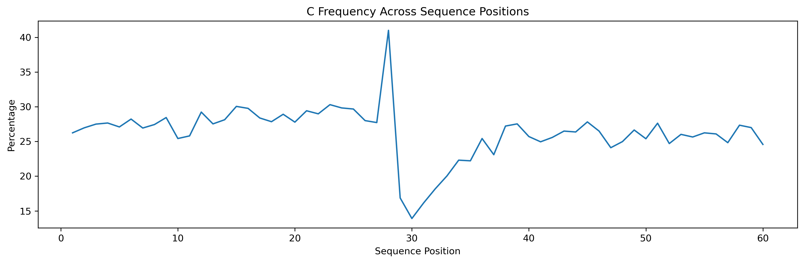

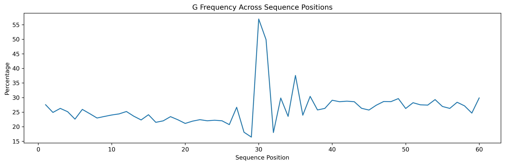

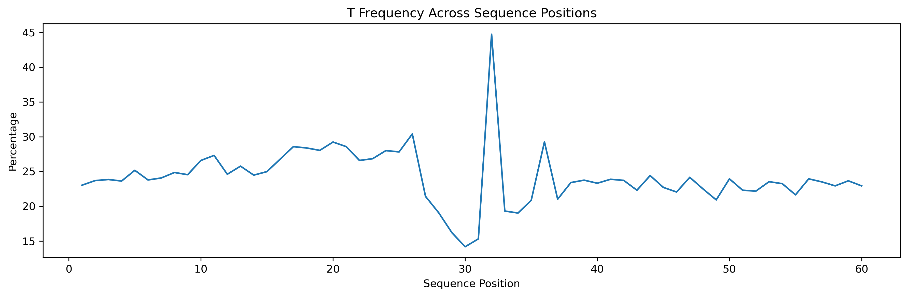

### Class-wise Positional Patterns

The class-wise positional plots help connect the sequence-level patterns back to the three classification targets.

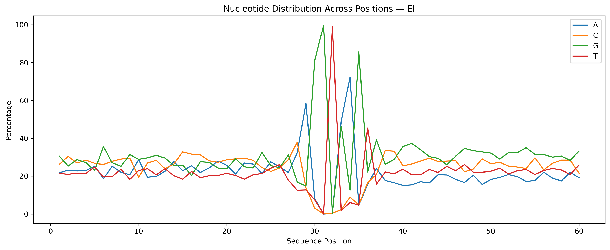

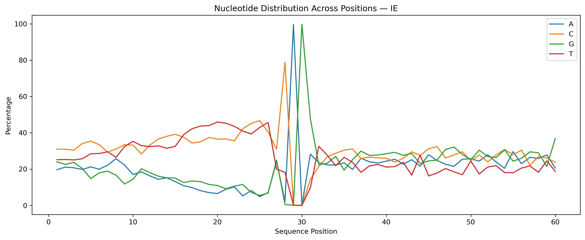

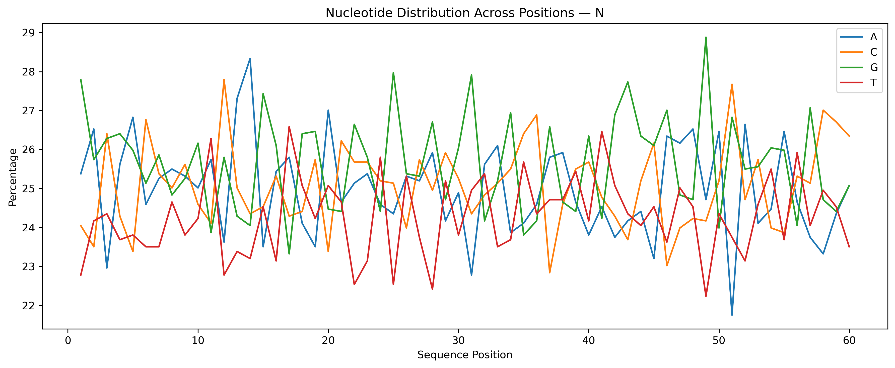

## 🧩 Feature Engineering ,  3-mers

Machine learning models require numerical input, so I converted each DNA sequence into a **k-mer frequency representation**.

A **k-mer** is a consecutive sequence of `k` nucleotides.

For this project, I used:

```text
k = 3
```

Examples:

```text
ATG
TGC
GCA
CAA
```

### Why k = 3?

I selected 3-mers because they provide a practical balance:

- They capture short local sequence patterns.
- They create a manageable feature representation.
- They work well with classical machine learning models such as SVM and Random Forest.
- They avoid making the feature space unnecessarily large.

The final representation contained:

```text
3,178 sequences × 97 features
```

This became the common feature representation for both models, allowing a fair comparison.

---

## 🤖 Machine Learning Models

### 1. Support Vector Machine

I used an **SVM with an RBF kernel**.

Final configuration:

```python
SVC(
    kernel="rbf",
    C=1.0,
    gamma="scale",
    random_state=42
)
```

The baseline SVM achieved:

**67.45% test accuracy**

I also performed controlled hyperparameter tuning using `C` and `gamma`. The tuned model achieved **67.14%**, which was slightly lower than the baseline.

Therefore, I retained the baseline SVM.

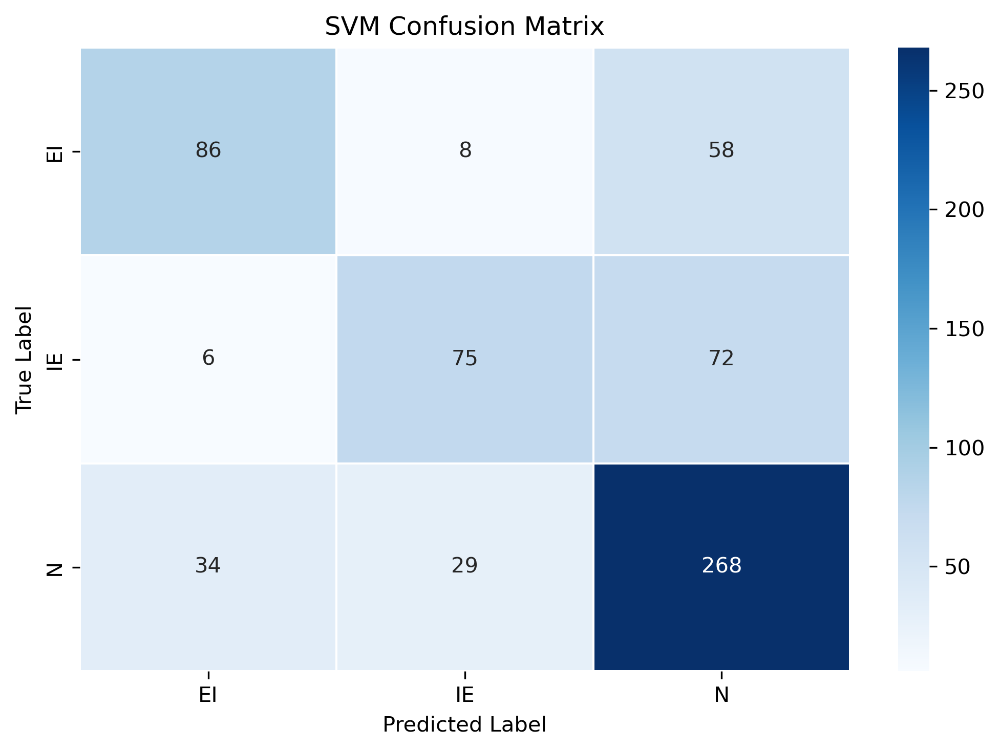

---

### 2. Random Forest

I used a **Random Forest classifier** with 100 trees.

Final configuration:

```python
RandomForestClassifier(
    n_estimators=100,
    random_state=42
)
```

The baseline Random Forest achieved:

**68.40% test accuracy**

I also performed controlled hyperparameter tuning. The tuned model achieved **67.92%**, which was slightly lower than the baseline.

Therefore, I retained the baseline Random Forest.

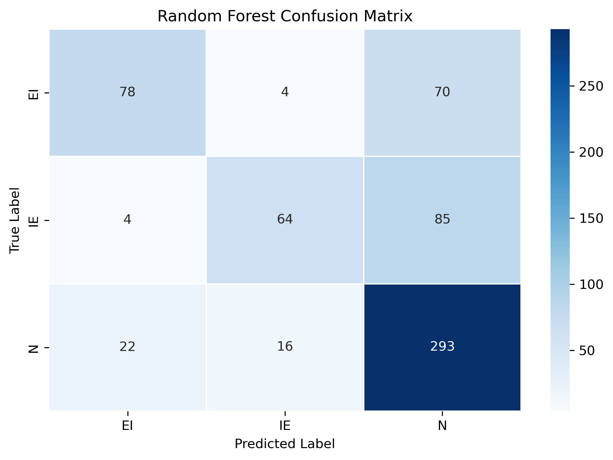

---

## 📈 Model Evaluation

Both models were evaluated on the **same stratified 20% test set** using `random_state=42`.

### Overall Performance

| Metric | SVM | Random Forest |
|---|---:|---:|
| Accuracy | 67.45% | **68.40%** |
| Weighted Precision | 0.6747 | **0.7029** |
| Weighted Recall | 0.6745 | **0.6840** |
| Weighted F1 | 0.6667 | **0.6671** |
| Macro F1 | **0.6400** | 0.6339 |

### Model Comparison

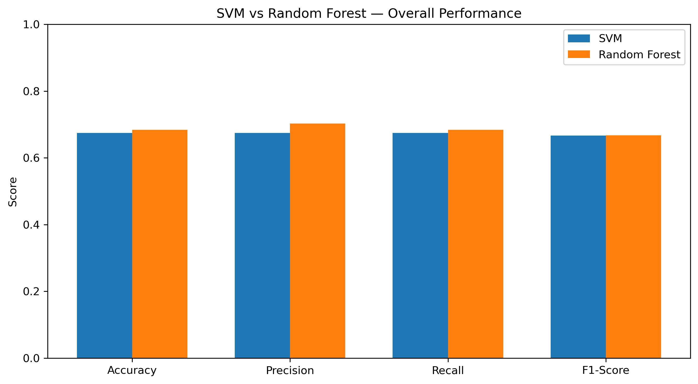

Random Forest achieved the highest overall accuracy.

However, SVM achieved a slightly higher **macro F1-score**, which gives equal importance to EI, IE, and N.

This means the difference between the models is not simply "Random Forest is better." The models show different strengths depending on which performance measure is considered.

---

## 🔍 Class-wise Findings

### SVM

| Class | Precision | Recall | F1-score |
|---|---:|---:|---:|
| EI | 0.6825 | 0.5658 | 0.6187 |
| IE | 0.6696 | 0.4902 | 0.5660 |
| N | 0.6734 | 0.8097 | 0.7353 |

### Random Forest

| Class | Precision | Recall | F1-score |
|---|---:|---:|---:|
| EI | 0.7500 | 0.5132 | 0.6094 |
| IE | 0.7619 | 0.4183 | 0.5401 |
| N | 0.6540 | 0.8852 | 0.7522 |

### What I found

The **N class was the easiest class for both models to identify**.

Random Forest achieved a particularly high recall for N:

**88.52%**

On the other hand, **IE was more difficult to identify**, especially for Random Forest, where recall was **41.83%**.

This shows that the three biological classes are not equally easy to separate using 3-mer frequency features.

---

## 🏆 Final Model Findings

The final models were:

| Model | Final configuration | Test accuracy |
|---|---|---:|
| SVM | RBF, `C=1.0`, `gamma="scale"` | 67.45% |
| Random Forest | 100 trees | **68.40%** |

### My interpretation

Random Forest has a small advantage in **overall accuracy**.

SVM has a small advantage in **macro F1**, meaning it provides slightly more balanced performance across the three classes.

Therefore, I would describe the result as:

> **Random Forest performed slightly better overall, while SVM provided slightly more balanced class-wise performance.**

---

## 💡 Key Project Findings

### 1. DNA sequence patterns contain useful classification information

The models were able to learn useful patterns from the 3-mer representation, showing that short local nucleotide patterns contain information relevant to splice-junction classification.

### 2. 3-mer representation provides a useful baseline

Using 3-mer frequencies gave the classical machine learning models a practical numerical representation of the DNA sequences.

However, frequency-based k-mers do not fully preserve the original sequence position or longer-range dependencies.

### 3. N was easier to classify

Both models achieved much higher recall for N than for EI and IE.

This indicates that distinguishing "neither" from splice-junction sequences was easier than distinguishing the two types of splice boundaries.

### 4. Model complexity did not automatically improve performance

Hyperparameter tuning slightly reduced test accuracy for both models.

This reinforced an important machine learning lesson:

> More tuning does not necessarily mean better performance.

### 5. Accuracy alone is not enough

The overall accuracy difference between the models was small.

Looking at **macro F1 and class-wise metrics** provided a better understanding of how the models behaved across EI, IE, and N.

---

## ⚠️ Limitations

This project has several limitations:

- The feature representation uses only **3-mer frequencies**.
- Frequency features do not fully preserve nucleotide position.
- Longer-range sequence dependencies are not directly represented.
- The dataset contains repeated sequences and one sequence with conflicting class labels.
- The dataset is relatively small for a biological classification problem.
- The experiment uses a single stratified train-test split.
- Classical models may not capture all the biological complexity present in DNA sequences.

These limitations should be considered when interpreting the reported performance.

---

## 🚀 Future Scope

There are several ways this project could be extended in the future.

### 🧬 1. Explore richer sequence representations

Instead of using only 3-mer frequencies, future work could investigate representations that preserve more positional information.

Possible directions include:

- Position-aware k-mers
- Combined k-mer sizes
- Sequence-based encodings
- Biological sequence embeddings

### 🔬 2. Investigate longer sequence patterns

3-mers capture short local patterns, but splice-junction recognition may also depend on longer patterns.

Future experiments could investigate whether larger k-mers or combinations of k-mer sizes improve classification.

### ⚖️ 3. Study class imbalance more deeply

The current dataset has a larger N class.

Future work could compare different imbalance-handling strategies and evaluate their effect using **macro F1 and per-class recall**, rather than optimizing only for accuracy.

### 🔁 4. Use more robust validation

A future version could use repeated cross-validation or another robust validation strategy to better understand how stable the model performance is across different data splits.

### 🧠 5. Explore more advanced models

Once the classical ML baseline is well established, future work could investigate sequence-oriented models such as:

- Gradient boosting approaches
- Neural networks
- CNN-based sequence models
- Transformer-based biological sequence models

The classical SVM and Random Forest results from this project can serve as a baseline for those experiments.

### 🧪 6. Add stronger biological interpretation

Future work could investigate which sequence patterns contribute most strongly to EI and IE recognition and connect those patterns to known biological splice signals.

---

## 📓 Notebook Structure

The project was developed notebook-by-notebook so that each stage has a clear purpose.

| Notebook | Purpose |
|---|---|
| `01_biological_background.ipynb` | Biological concepts, splice junctions, and k-mer introduction |
| `02_data_understanding.ipynb` | Dataset structure, classes, sequence properties, and initial checks |
| `03_data_cleaning.ipynb` | Duplicate handling, sequence validation, and cleaning decisions |
| `04_DNA_specific_eda.ipynb` | Nucleotide composition and position-wise DNA analysis |
| `05_k-mers_feature_engineering.ipynb` | 3-mer generation and numerical feature creation |
| `06_Support_Vector_Machine.ipynb` | SVM training, evaluation, and controlled tuning |
| `07_Random_Forest.ipynb` | Random Forest training, evaluation, and controlled tuning |
| `08_Model_Evaluation.ipynb` | Overall and class-wise model evaluation and comparison |
| `09_interpretation_conclusion.ipynb` | Interpretation, limitations, findings, and final conclusion |

---

## 📁 Repository Structure

```text
Splice_junction_classification/
│
├── data/
│   ├── raw/
│   │   ├── splice.data
│   │   ├── splice.data.Z
│   │   └── splice.names
│   │
│   └── processed/
│       ├── kmer_features.csv
│       └── kmer_target.csv
│
├── notebooks/
│   ├── 01_biological_background.ipynb
│   ├── 02_data_understanding.ipynb
│   ├── 03_data_cleaning.ipynb
│   ├── 04_DNA_specific_eda.ipynb
│   ├── 05_k-mers_feature_engineering.ipynb
│   ├── 06_Support_Vector_Machine.ipynb
│   ├── 07_Random_Forest.ipynb
│   ├── 08_Model_Evaluation.ipynb
│   └── 09_interpretation_conclusion.ipynb
│
├── reports/
│   └── figures/
│       ├── nucleotide_composition_by_class.png
│       ├── a_frequency_by_position.png
│       ├── c_frequency_by_position.png
│       ├── g_frequency_by_position.png
│       ├── t_frequency_by_position.png
│       ├── position_distribution_EI.png
│       ├── position_distribution_IE.png
│       ├── position_distribution_N.png
│       ├── svm_evaluation_confusion_matrix.png
│       ├── tuned_svm_confusion_matrix.png
│       ├── random_forest_confusion_matrix.png
│       ├── model_metric_comparison.png
│       └── rf_evaluation_confusion_matrix.png
│
└── Project_findings.md
```

---

## 🛠️ Technologies Used

- **Python**
- **Pandas** ,  data manipulation and analysis
- **NumPy** ,  numerical operations
- **Matplotlib** ,  visualizations
- **Seaborn** ,  confusion matrix visualizations
- **Scikit-learn** ,  preprocessing, SVM, Random Forest, model selection, and evaluation
- **Jupyter Notebook** ,  project development and documentation

---

## ▶️ How to Run

### 1. Clone the repository

```bash
git clone <your-repository-url>
cd Splice_junction_classification
```

### 2. Install the required libraries

```bash
pip install pandas numpy matplotlib seaborn scikit-learn jupyter
```

### 3. Start Jupyter Notebook

```bash
jupyter notebook
```

Open the notebooks in the `notebooks/` directory and run them in sequence.

---

## 📌 Final Takeaway

This project showed me that **machine learning can learn useful information from short DNA sequence patterns**, even with a relatively simple feature representation.

The final Random Forest achieved the highest overall accuracy of **68.40%**, while SVM achieved a slightly higher macro F1-score of **0.6400**.

More importantly, the project showed me that model performance should not be judged by accuracy alone. **Feature representation, class-wise performance, biological context, and evaluation strategy all matter.**

The biggest lesson I took from this project is:

> **A good machine learning solution starts with understanding the data and the problem, not just choosing a model.**

---

## 👩‍💻 About the Author

### Pallavi

I built this project to get hands-on experience with **machine learning on biological sequence data**.

I worked through the project step by step, starting with the biology behind splice junctions and moving through data cleaning, DNA-specific EDA, 3-mer feature engineering, model building, evaluation, and interpretation.

I wanted the project to be technically sound but also easy to follow, so I kept the implementation simple, documented my decisions, and focused on understanding why each step was needed.

---

<p align="center">
  <strong>🧬 Biological Data × 📊 Feature Engineering × 🤖 Machine Learning</strong>
</p>
